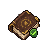

# Confirm Spellbook

Checks start when you withdraw a rune pouch or the Book of the Dead from the bank. Login and world hopping stay quiet. Carrying the book already confirms Arceuus; otherwise, you are asked to confirm your spellbook.

On Arceuus, reminds you about a missing thrall book or missing thrall runes. Confirm the rune warning if you plan to use other spells; after confirming Arceuus, you can also confirm the missing-book warning.
